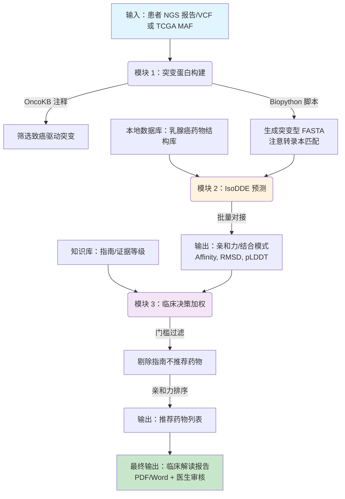

# 20260310-04-V3.0-基于乳腺癌的 IsoDDE API MVP

全程聚焦**乳腺癌（TCGA-BRCA）（癌症基因组图谱 - 乳腺浸润性癌）** 调整所有筛选 / 分析逻辑，按「模块 1（基因→标准化 FASTA）→模块 2（IsoDDE 药物筛选）→模块 3（临床权重排序）」拆解，重点落地MAF 路径、批量处理、脚本化等。

# 模块1乳腺癌驱动基因突变的蛋白序列的获取与标准化

## 模块定位

从 GDC 获取**乳腺癌目标临床队列**的**突变数据**，经 OncoKB **筛选**有临床意义的**驱动突变**，批量转化为 IsoDDE 可直接识别的标准化 **FASTA** 格式**突变蛋白序列**，是整个项目的**输入基础**。

## 临床数据源兼容设计

- 开发验证阶段：使用 TCGA-BRCA 公共队列（GDC MAF 格式），用于流程验证和模型调试；
- 临床落地阶段：预留患者本地 VCF/PDF 报告上传接口，支持医院 Panel-NGS/WES 检测报告解析；
- 格式转换：开发 MAF/VCF 统一解析脚本，确保两种数据源输出一致的突变列表格式；
- 原因说明：TCGA 是回顾性公共数据，适合训练验证；真实患者报告格式多样（医院特定 VCF/PDF），需兼容设计才能临床落地。

## 研究癌症种类：乳腺癌

- 研究癌种：乳腺癌（TCGA-BRCA）；
- 核心驱动基因：ERBB2（HER2）、ESR1、PIK3CA、TP53、CDH1 等（乳腺癌经典驱动基因）；
- 临床队列筛选条件：需贴合乳腺癌特征（如分子亚型 = HER2 阳性 / 三阴性、分期 = IIIC/IV 期、未接受抗 HER2 治疗等）。

## 实操步骤

### 步骤 1：GDC 筛选乳腺癌队列并导出 MAF 文件

#### 1.1 筛选目标队列

- 操作入口：GDC Portal → Cohort Builder
- 筛选条件：
    1. Project：TCGA-BRCA（乳腺癌数据集）；
    2. Clinical：
        - Tumor Stage：IIIC/IV 期（晚期）；
        - Molecular Subtype：HER2-positive（HER2 阳性，乳腺癌核心亚型）；
        - Treatment Type：未接受 Anti-HER2 Therapy（未接受抗 HER2 治疗）；
        - Vital Status：可选 DECEASED/LIVING（按需筛选）；
    3. Data Type：勾选「Simple Nucleotide Variation」（体细胞突变）。

#### 1.2 导出 MAF 文件

- 操作：筛选完成后 → Analyze → Mutation → Download → 选择「MAF」格式；

- MAF 文件路径问题解答：

    ✅ 正确路径：GDC 导出 MAF → 保存到本地电脑 → 用 OncoKB 完成注释（网页版直接上传本地 MAF）→ 注释后的 MAF 可上传 AutoDL（后续 SNPeff 批量处理用）。

### 步骤 2：OncoKB 批量注释 MAF 文件（获取临床意义标注）

#### 2.1 操作流程（乳腺癌专属）

1. 打开 OncoKB → Tools → Annotator；
2. 上传步骤 1 导出的本地 MAF 文件；
3. 选择 Cancer Type：「Breast Cancer」→ 选择 Subtype：「HER2-positive Breast Carcinoma」（匹配你的队列）；
4. 点击 Run Annotation → 下载带 OncoKB 注释的 MAF 文件（核心输出）；

**2.2 筛选规则（Excel 中操作）**

- 保留「Oncogenic=Yes」（致癌驱动突变）；
- 可选：保留「Mutation Frequency≥5%」（乳腺癌高频突变，避免稀有突变）；
- 最终得到：乳腺癌核心驱动突变列表（如 PIK3CA p.H1047R、ERBB2 p.V842I 等）。

#### 步骤 3：获取野生型蛋白 FASTA 序列

#### 3.1 批量下载

- 工具：UniProt Retrieve/ID Mapping（https://www.uniprot.org/id-mapping）；
- 操作：
    1. 从注释后的 MAF 中提取「Hugo_Symbol」列（如 ERBB2、PIK3CA、TP53），去重后复制；
    2. 打开 UniProt ID Mapping → 输入基因名列表 → 选择「From: Gene Name」→「To: UniProtKB」→ Run；
    3. 结果页面 → Download → 选择「FASTA (canonical)」→ 一键下载所有基因的野生型 FASTA（汇总为 1 个文件）；

#### 3.2 关键说明

- 优先使用「Canonical（经典）序列」	：是 UniProt 标注的主流功能序列，IsoDDE 识别最优；
- **转录本匹配校验**：若 OncoKB 注释中提供 Transcript ID（如 NM_006218.4），需核对 Canonical 序列是否覆盖该转录本的外显子区域，避免突变位点序列错位；
- **乳腺癌驱动基因注意**：ERBB2、ESR1 等基因存在多种剪切异构体，若突变发生在非 Canonical 外显子，需下载对应 Isoform 序列；
- 保存格式：汇总为「BRCA_Wildtype_FASTA.fasta」，便于后续批量处理。

#### 步骤 4：Biopython 批量生成突变型 FASTA 序列（修正版：替代 SNPeff 方案）

#### 4.1 前置准备

- 部署：Python 环境（推荐 AutoDL 云服务器，批量处理快），也可本地运行；
- 依赖：Biopython 库、OncoKB 注释后的 MAF 文件（含 HGVSp 字段）、野生型 FASTA 文件；
- 配置：安装 Biopython（`pip install biopython`），确认 MAF 文件中 HGVSp 字段格式完整（如 p.H1047R）；

#### 4.2 核心命令（AutoDL 云服务器运行）

```bash
# 1. 安装 Biopython 库
pip install biopython

# 2. 运行突变序列生成脚本
python generate_mutant_fasta.py --maf annotated_brca_maf.txt --wildtype BRCA_Wildtype_FASTA.fasta --output BRCA_Mutant_FASTA.fasta
```

```python
# generate_mutant_fasta.py 核心脚本
from Bio import SeqIO
import pandas as pd
import re

def parse_hgvsp(hgvsp):
    """解析 HGVSp 格式突变（如 p.H1047R）"""
    match = re.match(r'p\.([A-Z])(\d+)([A-Z*])', hgvsp)
    if match:
        return match.group(1), int(match.group(2)), match.group(3)
    return None

def generate_mutant_fasta(maf_file, wildtype_fasta, output_file):
    # 读取野生型序列
    wildtype_dict = SeqIO.to_dict(SeqIO.parse(wildtype_fasta, "fasta"))
    
    # 读取 MAF 文件
    maf_df = pd.read_csv(maf_file, sep='\t')
    
    with open(output_file, 'w') as out:
        for _, row in maf_df.iterrows():
            gene = row['Hugo_Symbol']
            hgvsp = row['HGVSp_Short']
            parsed = parse_hgvsp(hgvsp)
            
            if parsed and gene in wildtype_dict:
                wt_aa, pos, mut_aa = parsed
                seq = str(wildtype_dict[gene].seq)
                
                # 替换突变位点（注意：MAF 位置是 1-based，Python 是 0-based）
                if seq[pos - 1] == wt_aa:
                    mutant_seq = seq[:pos-1] + mut_aa + seq[pos:]
                    
                    # 写入 FASTA
                    out.write(f">{gene}_human_{hgvsp} (UniProt: {gene})\n")
                    out.write(mutant_seq + "\n")
    
    print(f'突变型 FASTA 生成完成！共 {len(maf_df)} 条序列')

# 运行
generate_mutant_fasta('annotated_brca_maf.txt', 'BRCA_Wildtype_FASTA.fasta', 'BRCA_Mutant_FASTA.fasta')
```

#### 4.3 关键说明

- **Biopython 方案优势**：直接读取 OncoKB 注释的 HGVSp 字段（如 p.H1047R），在野生型序列中指定位点替换氨基酸，比 SNPeff 更可控、更透明；
- **序列校验**：脚本自动校验野生型氨基酸是否匹配（如位置 1047 是否为 H），不匹配则跳过并记录警告，避免错误替换；
- **特殊突变处理**：移码突变、终止密码子提前等无法用于结构预测的突变，脚本自动过滤并输出日志；
- **输出**：每个突变对应 1 条 FASTA 序列，标注清晰（如 `>PIK3CA_human_p.H1047R (UniProt: PIK3CA)`），直接兼容 IsoDDE 输入格式；
- **患者 VCF 兼容**：同一脚本可适配患者本地 VCF 文件，只需修改 MAF 读取部分为 VCF 解析即可（预留接口）。

### 步骤 5：IsoDDE 适配的 FASTA 格式标准化

#### 5.1 Python 脚本

```python
# 脚本功能：将突变 FASTA 标准化为 IsoDDE 可识别的格式
# 输入：BRCA_Mutant_FASTA.fasta
# 输出：standardized_brca_fasta.fasta

def standardize_fasta(input_file, output_file):
    with open(input_file, 'r', encoding='utf-8') as f_in, open(output_file, 'w', encoding='utf-8') as f_out:
        for line in f_in:
            line = line.strip()
            # 处理标题行：简化命名，保留基因名 + 突变，符合 IsoDDE 规范
            if line.startswith('>'):
                # 提取基因名和突变
                parts = line.split(':')
                if len(parts) >= 3:
                    gene = parts[1].split('_')[0]  # 提取基因名（如 PIK3CA）
                    mutation = parts[-1]  # 提取突变（如 p.H1047R）
                    new_title = f'>{gene}_human_{mutation} (UniProt: {gene})'
                    f_out.write(new_title + '\n')
                else:
                    f_out.write(line + '\n')
            # 处理序列行：去除空格/换行，保留连续单字母氨基酸
            else:
                # 只保留氨基酸单字母编码（过滤无关字符）
                valid_aa = 'ACDEFGHIKLMNPQRSTVWY'
                clean_seq = ''.join([c for c in line if c in valid_aa])
                f_out.write(clean_seq + '\n')

# 运行脚本（替换为你的文件路径）
input_fasta = '/root/autodl-tmp/BRCA_Mutant_FASTA.fasta'  # AutoDL 云盘路径
output_fasta = '/root/autodl-tmp/standardized_brca_fasta.fasta'
standardize_fasta(input_fasta, output_fasta)
print('FASTA 标准化完成！')
```

#### 5.2 脚本使用说明

- 部署：将脚本上传 AutoDL 云服务器，修改文件路径（匹配你的 MAF/FASTA 位置）；
- 运行：`python fasta_standardize.py`；
- 输出：标准化后的 FASTA，标题行简洁（如`>PIK3CA_human_p.H1047R (UniProt: PIK3CA)`），序列无冗余字符。

### 步骤 6：序列质量校验（脚本 + 人工抽检）

#### 6.1 自动化校验

在上述脚本中添加校验逻辑，或单独写校验脚本：

```python
# 序列质量校验脚本
def check_fasta_quality(fasta_file):
    valid_aa = 'ACDEFGHIKLMNPQRSTVWY'
    errors = []
    with open(fasta_file, 'r', encoding='utf-8') as f:
        line_num = 0
        for line in f:
            line_num += 1
            line = line.strip()
            if not line:
                continue
            # 标题行校验
            if line.startswith('>'):
                if len(line) < 5 or ' ' in line[1:3]:  # 避免标题行格式错误
                    errors.append(f'第{line_num}行：标题行格式异常 → {line}')
            # 序列行校验
            else:
                invalid_chars = [c for c in line if c not in valid_aa]
                if invalid_chars:
                    errors.append(f'第{line_num}行：含无效字符 → {invalid_chars}')
    # 输出校验结果
    if errors:
        print('发现以下错误：')
        for err in errors:
            print(err)
    else:
        print('FASTA 格式校验通过！')

# 运行校验
check_fasta_quality(output_fasta)
```

#### 6.2 人工抽检（关键）

- 随机选 2-3 条序列（如 ERBB2 p.V842I），核对：
    1. 突变位点是否替换正确（如 V842→I）；
    2. 序列是否仅含氨基酸单字母编码；
    3. 标题行是否以`>`开头，无特殊字符。

#### 6.3 IsoDDE 验证

将标准化 FASTA 上传 IsoDDE，若工具无「格式错误」「序列无法识别」提示，即校验通过。

## 模块 1 输出物（核心）

- 乳腺癌目标队列信息表（Excel，含样本数、分期/亚型/治疗史统计）；
- 带 OncoKB 注释的 MAF 文件（筛选后，仅保留致癌驱动突变）；
- 标准化 FASTA 格式突变蛋白序列（AutoDL 云盘存储，直接供 IsoDDE 调用）；
- 突变列表（Excel，含基因名、突变位点、频率、Oncogenic 注释）；
- 临床队列特征/突变频率/预后信息（从 GDC 导出，供模块 3 使用）。

------


# 模块 2：IsoDDE 候选药物筛选（输入 / 输出 / 效果）

## 模块定位

以模块 1 的标准化 FASTA 序列为输入，通过 IsoDDE 筛选能与突变蛋白结合的候选药物，输出药物列表及结合评分。

## 核心输入

- **格式**：模块 1 输出的标准化 FASTA 文件（单个/多个突变序列均可）；
- **要求**：需选择突变蛋白的「功能结构域序列」（如 ERBB2 的激酶域，IsoDDE 对核心结构域筛选更精准）；
- **新增输入**：乳腺癌小分子药物结构库（SDF/MOL2 格式，从 DrugBank/PubChem 下载）。

### 药物结构库构建（新增）

**1.1 数据来源**
- 已上市乳腺癌靶向药库：DrugBank（https://go.drugbank.com/）→ 搜索「Breast Cancer」→ 导出获批药物SDF格式
- 临床在研药物库（可选）：ClinicalTrials.gov + PubChem → 在研靶向药3D结构

**1.2 预处理流程（RDKit标准化）**
```python
from rdkit import Chem
from rdkit.Chem import AllChem

def preprocess_drug_sdf(input_sdf, output_sdf):
    supplier = Chem.SDMolSupplier(input_sdf)
    writer = Chem.SDWriter(output_sdf)
    for mol in supplier:
        if mol is None:
            continue
        # 加氢
        mol = Chem.AddHs(mol)
        # 计算3D构象
        AllChem.EmbedMolecule(mol, AllChem.ETKDG())
        # 计算Gasteiger电荷（IsoDDE需要）
        AllChem.ComputeGasteigerCharges(mol)
        # 写入
        writer.write(mol)
    writer.close()
    print(f'药物结构预处理完成！')

# 运行
preprocess_drug_sdf('breast_cancer_drugs_raw.sdf', 'breast_cancer_drugs_processed.sdf')
```

**1.3 格式要求**

- 输入IsoDDE：SDF或MOL2格式（含3D构象+电荷信息）
- 推荐药物数量：MVP阶段50-100个（覆盖HER2、CDK4/6、PI3K、PARP等核心靶点）
- 药物示例：拉帕替尼、吡咯替尼、哌柏西利、阿培利司、奥拉帕利、T-DXd小分子载荷等

**1.4 药物库版本管理**

- 版本1（MVP）：已上市乳腺癌靶向药（约50个，数据稳定）
- 版本2（扩展）：+临床在研药物（约100个，需定期更新）


## 核心输出

IsoDDE 输出结果为表格文件（CSV/Excel），核心字段：

| 字段名              | 说明                                   | 示例                  |
| ------------------- | -------------------------------------- | --------------------- |
| Ligand Name         | 候选药物名称                           | Lapatinib（拉帕替尼） |
| Affinity (kcal/mol) | 结合自由能（负值越小，结合越稳定）     | -9.2                  |
| RMSD (Å)            | 构象均方根偏差（越小，结合构象越稳定） | 0.87                  |
| pLDDT               | 结构预测置信度（0-100，越高越可靠）    | 85                    |
| Pocket_ID           | 结合口袋编号（IsoDDE 盲口袋识别输出）  | Pocket_1              |

### 输出效果解读

- **核心排序依据**：Affinity＜-8.0 kcal/mol（结合稳定性优）；
- **辅助参考**：RMSD＜2.0 Å、pLDDT＞70 的药物，结构预测更可靠；
- 乳腺癌示例输出：
    - 拉帕替尼（Lapatinib）：Affinity=-9.2 kcal/mol（HER2 阳性乳腺癌经典靶向药）；
    - 吡咯替尼（Pyrotinib）：Affinity=-8.8 kcal/mol；
    - 来那替尼（Neratinib）：Affinity=-8.5 kcal/mol。

### 关键说明

- **IsoDDE 仅输出「药物 - 蛋白结合的理化评分」**，无临床意义；
- **输出的候选药物需经模块 3 的临床权重加权**，才具备实际应用价值；
- **隐蔽口袋发现**：若 IsoDDE 检测到突变后新开放的口袋，可提示潜在老药新用机会（科研价值高）。

------


# 模块 3：临床权重加权排序

## 模块定位

以模块 1 的「临床队列特征 / 突变频率 / 预后信息」为数据源，给 IsoDDE 的纯算法评分加「临床价值权重」，最终输出 “算法 + 临床” 的综合排序，筛选最具临床意义的候选药物。

### 核心数据源（来自模块 1）

| 数据源       | 来源                  | 核心字段/信息                                                |
| ------------ | --------------------- | ------------------------------------------------------------ |
| 临床队列特征 | GDC 导出的临床数据    | 乳腺癌亚型（HER2 阳性）、分期（IV 期）、治疗史（未接受抗 HER2 治疗） |
| 指南推荐级别 | OncoKB/NCCN/CSCO      | Level 1（FDA 批准）/Level 2（临床证据）/Level 3（临床前）    |
| 证据等级     | OncoKB                | Oncogenic=Yes/No，Resistance/Sensitive                       |
| 亚型匹配度   | GDC                   | 突变与研究亚型匹配=1，不匹配=0                               |
| 药物可及性   | 国家医保目录/医院药房 | 已上市/临床试验/不可及                                       |

### 权重维度与打分规则（乳腺癌专属）

| 权重维度     | 数据源       | 打分规则                              | 示例（ERBB2 p.V842I）       |
| ------------ | ------------ | ------------------------------------- | --------------------------- |
| 指南推荐级别 | NCCN/CSCO    | Level 1=1.0，Level 2=0.7，Level 3=0.3 | 1.0（拉帕替尼为 NCCN 推荐） |
| 证据等级     | OncoKB       | Oncogenic=Yes=1.0，Unknown=0.5        | 1.0                         |
| 耐药状态     | OncoKB/CIViC | 敏感=1.0，潜在耐药=0.5，已知耐药=0    | 0.5（部分耐药）             |
| 亚型匹配度   | GDC          | 匹配=1.0，不匹配=0                    | 1.0（HER2 阳性）            |
| 药物可及性   | 医保目录     | 已上市=1.0，临床试验=0.5，不可及=0    | 1.0                         |

### 耐药状态打分规则（MVP简化版）

**数据来源**：直接复用模块1 OncoKB注释结果，无需额外获取

**打分规则**：
| OncoKB字段 | 取值    | 耐药状态打分    |
| ---------- | ------- | --------------- |
| Level      | 1/2     | 1.0（敏感）     |
| Level      | 3/4     | 0.5（潜在敏感） |
| Oncogenic  | Yes     | 1.0             |
| Oncogenic  | Unknown | 0.5             |
| Resistance | 有标注  | 0（已知耐药）   |

**MVP阶段说明**：
- 优先使用OncoKB现有字段，降低数据获取复杂度
- 后续扩展阶段（3-6月）可补充CIViC API/文献人工整理
- 医生审核环节可手动修正耐药状态评分

### 综合得分计算（门槛 + 排序机制）

**方法 1：Excel 模板**

| 药物名称 | IsoDDE Affinity | 指南级别 | 证据等级 | 耐药状态 | 亚型匹配 | 可及性 | 门槛通过 | 最终排序 |
| -------- | --------------- | -------- | -------- | -------- | -------- | ------ | -------- | -------- |
| 拉帕替尼 | -9.2            | 1.0      | 1.0      | 0.5      | 1.0      | 1.0    | ✅        | 2        |
| 吡咯替尼 | -8.8            | 1.0      | 1.0      | 1.0      | 1.0      | 1.0    | ✅        | 1        |
| 实验药 X | -10.5           | 0.3      | 0.5      | 1.0      | 1.0      | 0      | ❌        | 剔除     |

**方法 2：Python 脚本（批量计算，AutoDL 运行）**

```python
# 临床权重加权排序脚本（门槛 + 排序机制）
import pandas as pd

# 1. 读取 IsoDDE 输出结果和临床权重数据
isodde_df = pd.read_csv('/root/autodl-tmp/isodde_output.csv')  # IsoDDE 输出
clinical_weights_df = pd.read_csv('/root/autodl-tmp/clinical_weights.csv')  # 临床权重表

# 2. 合并数据（按药物名称匹配）
merged_df = pd.merge(isodde_df, clinical_weights_df, on='Ligand Name', how='left')

# 3. 门槛过滤（指南级别<0.5 或可及性=0 的药物直接剔除）
merged_df['门槛通过'] = (merged_df['指南级别'] >= 0.5) & (merged_df['可及性'] > 0)
filtered_df = merged_df[merged_df['门槛通过'] == True]

# 4. 计算临床权重总分（用于同亲和力时的排序参考）
weight_cols = ['指南级别', '证据等级', '耐药状态', '亚型匹配', '可及性']
filtered_df['临床权重总分'] = filtered_df[weight_cols].sum(axis=1)

# 5. 按 IsoDDE 亲和力降序排序（临床权重总分作为次要排序依据）
final_df = filtered_df.sort_values(['Affinity (kcal/mol)', '临床权重总分'], 
                                   ascending=[True, False])

# 6. 输出最终排序结果
final_df.to_csv('/root/autodl-tmp/final_drug_ranking.csv', index=False)
print('临床权重加权排序完成！')
print('最终排序前 3：')
print(final_df[['Ligand Name', 'Affinity (kcal/mol)', '临床权重总分']].head(3))
```

- ### 模块 3 输出物

    - 临床权重打分表（Excel，含各维度得分、权重总分）；
    - 最终药物排序表（CSV/Excel，按亲和力降序，标注临床价值）；
    - **临床解读报告**（PDF/Word，含突变信息、推荐药物、指南依据、用药建议）；
    - 排序说明文档（解释为何某药物排第一，如"吡咯替尼亲和力优且耐药状态好"）。

    ### 核心价值

    - 把 IsoDDE 的"纯实验室算法得分"转化为"临床可落地的药物优先级"；
    - **临床合规性优先**：指南不推荐的药物无论亲和力多高均被剔除；
    - 例如：IsoDDE 亲和力稍低的吡咯替尼，因临床耐药状态好、指南推荐级别高，最终排第一，成为湿实验优先验证的药物。

------




## 核心总结（3 个模块关键）

| 模块       | 核心任务                 | 关键修正                                                    | 输出物                                  |
| ---------- | ------------------------ | ----------------------------------------------------------- | --------------------------------------- |
| **模块 1** | 批量获取高质量靶蛋白序列 | SNPeff→Biopython、增加转录本匹配、TCGA/患者兼容             | 标准化 FASTA 突变蛋白序列               |
| **模块 2** | IsoDDE 药物结合评分      | 增加配体库输入、替换输出字段、增加隐蔽口袋分析              | 药物亲和力评分表（Affinity/RMSD/pLDDT） |
| **模块 3** | 临床权重加权排序         | 突变发生率→指南级别、线性评分→门槛 + 排序、增加临床解读报告 | 最终药物排序表 + 临床解读报告           |

### 核心价值闭环

```
基因测序 → 蛋白序列 → IsoDDE 亲和力预测 → 临床权重过滤 → 医生审核 → 湿实验验证
```

- **模块 1**：乳腺癌队列→GDC MAF→OncoKB 注释→UniProt 野生型 FASTA→Biopython 突变 FASTA→脚本标准化，核心是"批量获取高质量靶蛋白序列"；
- **模块 2**：IsoDDE 输入 FASTA+ 药物结构库，输出药物结合评分（仅理化属性，无临床意义）；
- **模块 3**：用指南/证据等级给 IsoDDE 得分加权，输出"算法 + 临床"的最终药物排序，直接指导湿实验。


---

